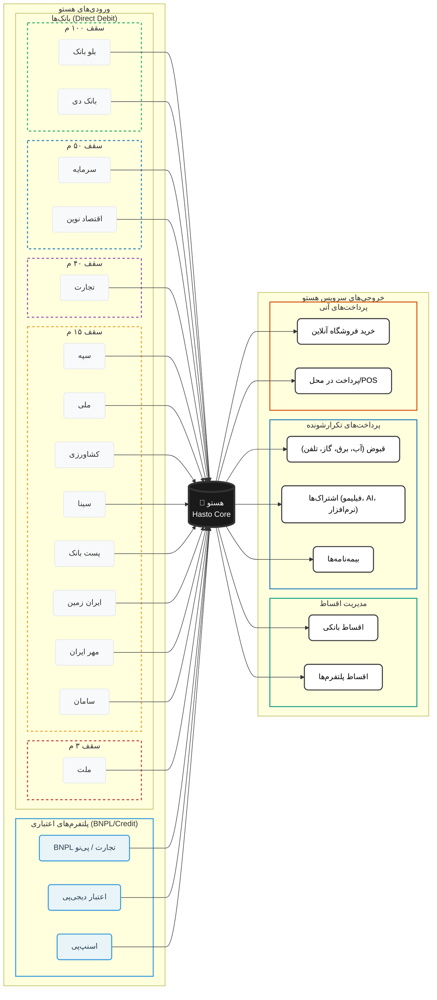

## سقف برداشت قرداداد های Direct Debit

- برداشت تا 100 میلیون
	- بلو بانک
	- بانک دی
- برداشت تا 50 میلیون
	- سرمایه
	- اقتصاد نوین
- برداشت تا 40 میلیون
	- تجارت
- برداشت تا 15 میلیون
	- سپه
	- ملی
	- کشاورزی
	- سینا
	- پست بانک
	- ایران زمین
	- مهر
	- سامان
- برداشت تا 3 میلیون
	- ملت

---

بسیار عالی. این تغییر، «هستو» را از یک ساده‌ساز برداشت بانکی به یک **Aggregator اعتبار هوشمند** تبدیل می‌کند. حالا ما دو نوع ورودی داریم:
1.  **ورودی نقدینگی (Liquidity):** بانک‌ها (Direct Debit)
2.  **ورودی اعتبار (Credit Lines):** پلتفرم‌های BNPL و فین‌تک‌ها

من نمودار را طوری بازنویسی کردم که این دو دسته ورودی در سمت چپ مشخص باشند و همگی به هستو متصل شوند. همچنین برای پلتفرم‌های اعتباری، نام سرویس‌دهنده اصلی (مثل تجارت یا دیجی‌کالا) را هم ذکر کردم تا شفافیت بیشتری داشته باشد.

### نکات کلیدی این معماری جدید:
*   **تمایز رنگی:** پلتفرم‌های اعتباری (BNPL) با رنگ آبی روشن (`creditNode`) از بانک‌ها متمایز شده‌اند تا نشان دهند ماهیت آن‌ها "خط اعتبار" است نه لزوماً "موجودی نقد".
*   **انعطاف‌پذیری:** این ساختار به تو اجازه می‌دهد هر پلتفرم جدیدی (مثل تارا، ازکی‌وام، یا لندو) را به راحتی به بخش `CreditPlatforms` اضافه کنی.
*   **یکپارچگی:** چه پول از حساب بانکی بیاید، چه از اعتبار اسنپ‌پی، همه در «هستو» تجمیع شده و کاربر می‌تواند تصمیم بگیرد کدام بدهی یا خرید را اولویت‌بندی کند.

آیا می‌خواهی منطق **"Smart Routing"** (مسیریابی هوشمند) را هم اضافه کنیم؟ مثلاً اینکه هستو چگونه تصمیم بگیرد برای پرداخت قبض برق، اول از کدام منبع (بانک یا اعتبار) برداشت کند؟

---
