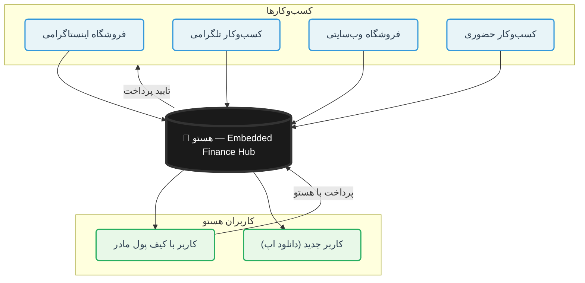

# هستو — لایه B2B: Embedded Finance / پلتفرم پرداخت برای کسب‌وکارها

## معرفی

**هستو B2B** یک لایه Embedded Finance است که به هر کسب‌وکاری (اینستاگرامی، تلگرامی، سایت‌دار، حضوری) اجازه میده "دکمه پرداخت هستو" رو به فرایند فروششون اضافه کنن.

> **پیام کلیدی:** "هر کسب‌وکاری، هر اسکیلی، بدون اصطکاک"

---

## مشکل فعلی

- فروشندگان اینستاگرامی مجوز درگاه پرداخت ندارند
- مجبورن شماره کارت بدن → کارت به کارت → اصطکاک
- مشتری باید اسکرین‌شات واریز بفرسته → تایید دستی
- عدم اعتماد بین فروشنده و خریدار
- درگاه‌های پرداخت برای کسب‌وکارهای کوچک پیچیده‌اند

---

## راه‌حل: Embedded Finance هستو

هستو به عنوان یک SDK/API به کسب‌وکارها اجازه میده "دکمه پرداخت هستو" رو به فرایند فروششون اضافه کنن.

---

## نمودار معماری B2B



---

## صفحات B2B (پنل کسب‌وکار)

### صفحه ۱: ورود و احراز هویت کسب‌وکار

#### مرحله ۱: ورود
- فرم شماره موبایل
- کد OTP (همانند B2C)
- ورود خودکار بعد از تکمیل

#### مرحله ۲: احراز هویت کسب‌وکار
- **اطلاعات هویتی:**
  - نام کسب‌وکار
  - نوع فعالیت (فروشگاهی/خدماتی/تولیدی/...)
  - شماره ثبت/شماره ملی
  - آدرس
  - شماره تماس
- **اطلاعات بانکی:**
  - شماره حساب
  - شماره شبا
  - نام صاحب حساب
- **مدارک:**
  - تصویر کارت ملی
  - تصویر جواز کسب (اختیاری)
  - تصویر فاکتور رسمی (اختیاری)
- **وضعیت احراز هویت:**
  - 🟡 در انتظار بررسی
  - 🟢 تایید شده
  - 🔴 رد شده

---

### صفحه ۲: داشبورد کسب‌وکار

#### بخش ۱: خلاصه مالی
- مبلغ کل دریافتی (امروز/این هفته/این ماه)
- تعداد تراکنش‌ها
- میانگین مبلغ هر تراکنش
- نمودار دریافتی روزانه (۷ روز اخیر)

#### بخش ۲: آخرین پرداخت‌ها
- لیست ۵ پرداخت اخیر
- نمایش: نام خریدار + مبلغ + وضعیت + تاریخ

#### بخش ۳: دسترسی سریع
- **ساخت لینک پرداخت** → صفحه ۳
- **مدیریت محصولات** → صفحه ۴
- **قراردادها** → صفحه ۵
- **ابزارها** → صفحه ۶

#### نوار پایین (Bottom Navigation)
1. **داشبورد** → صفحه ۲
2. **محصولات** → صفحه ۴
3. **پرداخت** (دکمه بزرگ مرکزی) → صفحه ۳
4. **قراردادها** → صفحه ۵
5. **ابزارها** → صفحه ۶

---

### صفحه ۳: ساخت لینک پرداخت

#### روش ۱: لینک ساده
- فرم مبلغ
- فرم توضیح/عنوان
- دکمه "ساخت لینک"
- نمایش لینک + دکمه کپی
- اشتراک‌گذاری در پیامرسان

#### روش ۲: لینک محصول
- انتخاب محصول از لیست محصولات
- نمایش قیمت محصول
- دکمه "ساخت لینک پرداخت محصول"
- لینک شامل: نام محصول + قیمت + توضیحات

#### روش ۳: QR کد اختصاصی
- نمایش QR کد اختصاصی کسب‌وکار
- دکمه دانلود/اشتراک‌گذاری QR

---

### صفحه ۴: مدیریت محصولات (Product Management)

#### لیست محصولات
- هر محصول در یک کارد جداگانه:
  - نام محصول
  - قیمت
  - موجودی (اختیاری)
  - وضعیت (فعال/غیرفعال)
  - تعداد فروش
- دکمه "ویرایش" / "حذف"

#### افزودن محصول جدید
- نام محصول
- قیمت (ریال)
- توضیحات
- تصویر محصول (اختیاری)
- دسته‌بندی
- موجودی (اختیاری)
- دکمه "ذخیره"

#### ویژگی‌های کلیدی
- برای هر محصول یک **لینک پرداخت اختصاصی** ساخته میشه
- کاربر میتونه لینک رو مستقیماً بفرسته
- مشتری روی لینک میزنه → اطلاعات محصول رو میبینه → پرداخت رو انجام میده

---

### صفحه ۵: قراردادهای کسب‌وکار (Business Contracts)

#### انواع قراردادهای کسب‌وکار
1. **قرارداد اشتراک ماهانه:** مثلاً اشتراک باشگاه مشتریان
2. **قرارداد پرداخت دوره‌ای:** مثلاً اجاره مغازه
3. **قرارداد اقساط:** مثلاً فروش اقساطی محصول

#### ساخت قرارداد جدید
- نام قرارداد
- نام مشتری (شماره موبایل)
- مبلغ قرارداد
- دوره پرداخت (ماهانه/هفتگی/سالانه)
- تاریخ شروع و انقضا
- توضیحات
- دکمه "ذخیره و اشتراک‌گذاری"

#### اشتراک‌گذاری قرارداد
- لینک مستقیم
- QR کد
- شناسه قرارداد

---

### صفحه ۶: ابزارهای کسب‌وکار (Business Tools)

#### بخش ۱: API و کلید API
- نمایش کلید API فعلی
- دکمه "تولید کلید جدید"
- مستندات API (لینک به مستندات)
- مثال‌های استفاده
- محدودیت‌های API (تعداد درخواست در دقیقه)

#### بخش ۲: ربات تلگرام
- دکمه "فعال‌سازی ربات تلگرام"
- لینک ربات تلگرام
- تنظیمات ربات:
  - پاسخ خودکار به سوالات
  - نمایش محصولات
  - ارسال لینک پرداخت
- پیش‌نمایش ربات

#### بخش ۳: ربات پاسخگویی اتوماتیک اینستاگرام
- دکمه "فعال‌سازی ربات اینستاگرام"
- اتصال به اکانت اینستاگرام
- تنظیمات ربات:
  - پاسخ خودکار به دایرکت
  - وقتی مشتری کد محصول رو فرستاد:
    1. کد محصول رو استخراج میکنه
    2. اطلاعات محصول رو نمایش میده
    3. لینک پرداخت رو ارسال میکنه
  - پاسخ به سوالات متداول
- پیش‌نمایش ربات

#### بخش ۴: صفحه وب اختصاصی (فروشگاه)
- دکمه "ساخت صفحه وب"
- آدرس صفحه وب اختصاصی: `hasto.to/shop/[نام-کسب-وکار]`
- نمایش لیست محصولات
- هر محصول دکمه "خرید" → لینک پرداخت
- سفارشی‌سازی ظاهر (لوگو، رنگ)
- پیش‌نمایش صفحه

---

### صفحه ۷: لیست تراکنش‌های کسب‌وکار
- لیست پرداخت‌های دریافتی
- وضعیت (موفق/در انتظار/ناموفق)
- مبلغ + تاریخ + نام خریدار
- جستجو و فیلتر
- صورتحساب
- دانلود گزارش (CSV/Excel)

### صفحه ۸: تنظیمات کسب‌وکار
- نام کسب‌وکار
- آدرس
- شماره تماس
- اطلاعات بانکی
- تنظیمات تسویه (روزانه/هفتگی/ماهانه)
- تنظیمات اعلان‌ها
- حساب کاربری

---

## مزیت‌های B2B برای کسب‌وکارها

| مزیت | توضیح |
|------|--------|
| بدون نیاز به درگاه پرداخت | فقط لینک یا QR بساز |
| پرداخت سریع مشتری | مشتری فقط تایید میکنه |
| تسویه خودکار | پول مستقیماً به حساب واریز میشه |
| مدیریت محصولات | لیست محصولات + قیمت + موجودی |
| ربات تلگرام | پاسخ خودکار به مشتریان |
| ربات اینستاگرام | پاسخ خودکار به دایرکت‌ها |
| صفحه وب اختصاصی | فروشگاه آنلاین رایگان |
| API | توسعه و سفارشی‌سازی |

---

## سناریوهای استفاده

### سناریو ۱: فروشگاه اینستاگرامی
```
قبل:
  مشتری → دایرکت → سوال → شماره کارت → کارت به کارت → چک واریز → ارسال

بعد:
  مشتری → دایرکت → سوال → لینک پرداخت هستو → پرداخت با هستو → تایید خودکار → ارسال
```

### سناریو ۲: سایت فروشگاهی
```
قبل:
  سبد خرید → درگاه پرداخت بانکی → وارد کردن اطلاعات کارت → پرداخت

بعد:
  سبد خرید → دکمه "پرداخت با هستو" → اپ هستو باز میشه → تایید با اثر انگشت → پرداخت
```

### سناریو ۳: کسب‌وکار تلگرامی/واتساپی
```
قبل:
  پیام → شماره کارت → کارت به کارت → اسکرین‌شات واریز → تایید

بعد:
  پیام → لینک پرداخت هستو → پرداخت در اپ → تایید خودکار
```

### سناریو ۴: ربات اینستاگرام
```
مشتری → دایرکت → "پیراهن مردانه"
ربات → اطلاعات محصول + لینک پرداخت
مشتری → لینک رو میزنه → پرداخت رو انجام میده
ربات → تایید سفارش + ارسال
```

---

## مدل درآمدی B2B

| منبع درآمد | توضیح |
|-------------|-------|
| کارمزد تراکنش | ۱-۲٪ از هر پرداخت موفق |
| اشتراک ماهانه | پنل پیشرفته + API |
| کارمزد تسویه سریع | تسویه فوری (به جای روزانه) |
| همکاری در فروش | کمیسیون از خدمات ارزش افزوده |
