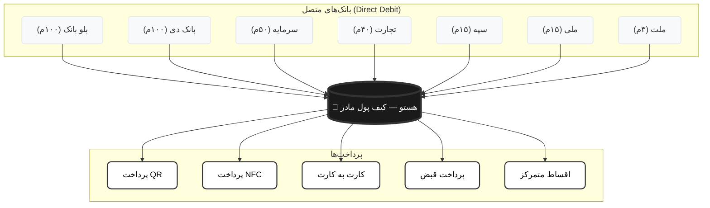

# هستو — لایه B2C: کیف پول مادر / هسته پرداخت شخصی

## معرفی

**هستو B2C** یک کیف پول مادر/مرکزی است که کاربر یکبار حساب‌ها و کارت‌های بانکیش رو بهش وصل میکنه (با قراردادهای Direct Debit) و از این به بعد فقط با یک کارت زندگی میکنه.

> **پیام کلیدی:** "یک کارت، همه پرداخت‌ها"

---

## مشکل فعلی

- کاربر ۵-۱۰ کارت بانکی داره
- هر کارت سقف و موجودی متفاوتی داره
- وقتی موجودی یک کارت تموم میشه، باید برگرده و از کارت دیگه استفاده کنه
- فراموش میکنه کدوم کارت چقدر موجودی داره
- اصطکاک پرداخت بالاست

---

## راه‌حل: کیف پول مادر هستو

کاربر یک حساب "مادر" در بانک تجارت ایجاد میکنه (یا حساب قبلیشو تبدیل میکنه). این حساب، کیف پول مرکزی هستوئه. همه پرداخت‌ها از این حساب انجام میشه.

### منطق شارژ خودکار
```
اگر موجودی کیف پول مادر < مبلغ پرداخت:
  ۱. از حسابی که بیشترین موجودی رو داره برداشت کن
  ۲. یا از حسابی که کاربر اولویت‌بندی کرده
  ۳. یا از همه حساب‌ها به نسبت
```

---

## نمودار معماری B2C



---

## اتصال حساب‌ها (Direct Debit)

کاربر یکبار قراردادهای Direct Debit رو با بانک‌ها امضا میکنه:

| بانک | سقف برداشت |
|------|-----------|
| بلو بانک | ۱۰۰ میلیون |
| بانک دی | ۱۰۰ میلیون |
| سرمایه | ۵۰ میلیون |
| اقتصاد نوین | ۵۰ میلیون |
| تجارت | ۴۰ میلیون |
| سپه | ۱۵ میلیون |
| ملی | ۱۵ میلیون |
| کشاورزی | ۱۵ میلیون |
| سینا | ۱۵ میلیون |
| پست بانک | ۱۵ میلیون |
| ایران زمین | ۱۵ میلیون |
| مهر | ۱۵ میلیون |
| سامان | ۱۵ میلیون |
| ملت | ۳ میلیون |

---

## صفحات B2C

### صفحه ۱: ورود (Login)
- شماره موبایل با `09` پیش‌فرض
- کد OTP با تشخیص خودکار (سبز/قرمز)
- ورود خودکار بعد از تکمیل

### صفحه ۲: داشبورد اصلی (هوم)
- کیف پول مادر (کارت بزرگ)
- دو دکمه اصلی: واریز + دریافت
- آخرین تراکنش‌ها
- هدر: آیکون پروفایل (راست) + آیکون اعلانات (چپ)

### صفحه ۳: واریز (Transfer)
- کادر ورود شماره (موبایل/کارت/شبا)
- تشخیص خودکار نوع شماره
- لیست مقصد‌های قبلی
- دکمه‌های شناور (اسکن + تایید)

### صفحه ۴: دریافت (Receive)
- QR کد کیف پول مادر
- شماره کارت و شبا
- دکمه "دریافت با شناسه"

### صفحه ۵: تایید پرداخت
- نام گیرنده + مبلغ
- دکمه "تایید"

### صفحه ۶: رمز/بیومتریک
- رمز ۶ رقمی
- بیومتریک (Mock)

### صفحه ۷: رسید پرداخت
- رسید کامل + دکمه اشتراک‌گذاری

### صفحه ۸: پرداخت قبض
- لیست قبوض + دکمه "پرداخت همه"

### صفحه ۹: اقساط متمرکز
- لیست اقساط + نوار پیشرفت

### صفحه ۱۰: تاریخچه تراکنش‌ها
- لیست تراکنش‌ها + فیلتر + جستجو

### صفحه ۱۱: مدیریت مالی
- تب ۱: موجودی نقدی (تراکنش‌ها + نمودارها)
- تب ۲: موجودی غیر نقدی (سهام، طلا، ارز)
- تب ۳: بدهی‌ها (دستی + قراردادی)
- تب ۴: طلب‌ها (دستی + قراردادی)

### صفحه ۱۲: خدمات
- ۱۸ دسته‌بندی خدمات
- فیلتر و جستجو
- فقط نمایش (بدون عملیات)

### صفحه ۱۳: قراردادها
- ۵ دسته قرارداد
- وضعیت (سبز/قرمز/زرد)
- جزئیات + لغو + اشتراک‌گذاری

### صفحه ۱۴: پرداخت (Payment)
- ۴ روش پرداخت
- شناسه واریز / اسکن QR / NFC / پرداخت نزدیک

### صفحه ۲۰: پروفایل کاربر
- اطلاعات شخصی + تنظیمات برنامه

### صفحه ۲۱: مرکز اعلان‌ها
- لیست اعلان‌ها (خوانده شده/خوانده نشده)

---

## نوار پایین (Bottom Navigation)

1. **خانه** (داشبورد)
2. **مدیریت مالی**
3. **پرداخت** (دکمه بزرگ مرکزی)
4. **خدمات**
5. **قراردادها**

---

## هدر صفحه

- **بالا سمت راست:** آیکون پروفایل کاربر
- **بالا سمت چپ:** آیکون اعلانات
- **وسط:** لوگوی هستو

---

## مزیت رقابتی

| ویژگی | هستو | رقبا |
|--------|------|------|
| تعداد کارت مورد نیاز | ۱ | ۵-۱۰ |
| Direct Debit چند بانکه | بله | خیر |
| شارژ خودکار | بله | خیر |
| اقساط متمرکز | بله | خیر |
| پرداخت QR + NFC | بله | محدود |
| قراردادهای شخصی | بله | خیر |
| مدیریت بدهی و طلب | بله | محدود |

---

## نقشه راه B2C

### فاز ۱: MVP (ماه ۱-۳)
- [ ] ثبت‌نام و احراز هویت
- [ ] اتصال کارت‌ها + Direct Debit
- [ ] کیف پول مادر + شارژ خودکار
- [ ] پرداخت QR + NFC + شناسه + لوکیشن
- [ ] انتقال وجه (واریز/دریافت)
- [ ] مدیریت مالی (نقدی/غیرنقدی/بدهی/طلب)
- [ ] خدمات (۱۸ دسته)
- [ ] قراردادها (۵ دسته)
- [ ] پروفایل و اعلانات

### فاز ۲: رشد (ماه ۴-۶)
- [ ] تحلیل مالی هوشمند
- [ ] امتیاز اعتباری
- [ ] چند بانک شریک

### فاز ۳: بلوغ (ماه ۷-۱۲)
- [ ] API عمومی
- [ ] اپلیکیشن iOS + Android
- [ ] بین‌المللی شدن
