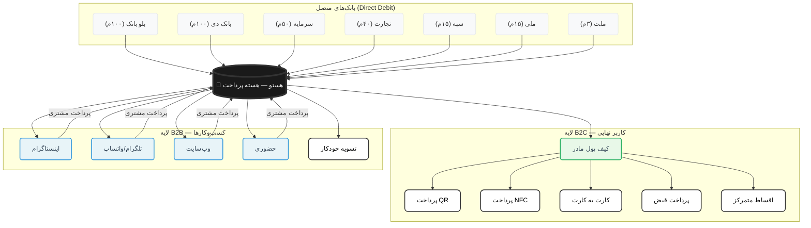

# هستو (Hasto) — PRD کلی محصول

## خلاصه اجرایی

**هستو** (از هسته = Core) یک پلتفرم پرداخت مرکزی است که هسته اکوسیستم پرداخت ایران می‌شود. دو لایه اصلی دارد:

- **B2C** → کیف پول مادر / حساب مرجع → [جزئیات کامل](Hasto-B2C.md)
- **B2B** → Embedded Finance برای کسب‌وکارها → [جزئیات کامل](Hasto-B2B.md)

**بانک شریک اصلی:** بانک تجارت

---

## معماری کلی — هستو به عنوان هسته

---

## چرا هستو؟

### مشکل فعلی بازار
- کاربران ۵-۱۰ کارت بانکی دارند، هر کدام سقف و موجودی متفاوت
- فروشندگان اینستاگرامی/تلگرامی مجوز درگاه پرداخت ندارند → کارت به کارت میکنند → اصطکاک برای هر دو طرف
- اقساط BNPL پراکنده‌اند (اسنپ‌پی، دیجی‌پی، تارا و...)
- قبوض و اشتراکات فراموش میشوند
- هیچ دید کلی از وضعیت مالی وجود نداره

### راه‌حل هستو
- **یک حساب مرجع** که همه چیز بهش وصله
- **یک کارت** که جای همه کارت‌ها رو میگیره
- **یک پرداخت** که هرجا لازم باشه ظاهر میشه
- **بازیگر پشت صحنه** — نامرئی ولی حیاتی (مثل مفهوم Linchpin)

### مزیت رقابتی
| ویژگی | هستو | رقبا |
|--------|------|------|
| تعداد کارت مورد نیاز | ۱ | ۵-۱۰ |
| Direct Debit چند بانکه | بله | خیر |
| Embedded Finance برای کسب‌وکار | بله | محدود |
| مدیریت اقساط متمرکز | بله | خیر |
| پرداخت خودکار | بله | خیر |
| قراردادهای شخصی | بله | خیر |
| مدیریت بدهی و طلب | بله | محدود |

---

## مدل درآمدی

| منبع درآمد | توضیح |
|-------------|-------|
| کارمزد تراکنش B2C | ۰.۵٪ از هر پرداخت (از فروشنده) |
| کارمزد تراکنش B2B | ۱-۲٪ از هر پرداخت (از کسب‌وکار) |
| اشتراک پرنايوم | قابلیت‌های پیشرفته (تحلیل مالی، چند کاربر) |
| کارمزد انتقال وجه | مبالغ بالای ۵۰ میلیون |
| همکاری در فروش | کمیسیون از BNPL و وام‌ها |
| اشتراک کسب‌وکار | پنل پیشرفته + API |
| کارمزد API | استفاده از API برای توسعه‌دهندگان |

---

## نقشه راه

### فاز ۱: MVP (ماه ۱-۳)
- ثبت‌نام و احراز هویت کاربر
- اتصال کارت‌های بانکی + قرارداد Direct Debit
- کیف پول مادر با شارژ خودکار
- پرداخت QR + NFC + شناسه + لوکیشن
- انتقال وجه (واریز/دریافت)
- مدیریت مالی (نقدی/غیرنقدی/بدهی/طلب)
- خدمات (۱۸ دسته)
- قراردادها (۵ دسته)
- پنل کسب‌وکار ساده

### فاز ۲: رشد (ماه ۴-۶)
- مدیریت محصولات کسب‌وکار
- قراردادهای کسب‌وکار
- API و کلید API
- ربات تلگرام
- ربات پاسخگویی اتوماتیک اینستاگرام
- صفحه وب اختصاصی (فروشگاه)
- چند بانک شریک

### فاز ۳: بلوغ (ماه ۷-۱۲)
- تحلیل مالی هوشمند (PFM)
- اعتبارسنجی و امتیاز اعتباری
- API عمومی
- اپلیکیشن iOS + Android کامل
- بین‌المللی شدن

---

## چالش‌ها و ریسک‌ها

| چالش | راه‌حل |
|------|--------|
| رگولاتوری Direct Debit | همکاری نزدیک با بانک تجارت + مشاوره حقوقی |
| اعتماد کاربران | مجوز رسمی بانک تجارت + شفافیت عملیات |
| رقابت با اسنپ‌پی/دیجی‌پی | تمرکز روی Direct Debit (مزیت منحصربفرد) |
| جذب کسب‌وکارها | MVP رایگان برای کسب‌وکارهای کوچک |
| مقیاس‌پذیری فنی | معماری میکروسرویس + کلاود |
| احراز هویت کسب‌وکارها | فرایند ساده + بررسی سریع |

---

## ارائه به هیئت مدیره

### ساختار ارائه (۲۵ دقیقه)
1. **مشکل** — نمایش همه کارت‌ها + اصطکاک پرداخت (۲ دقیقه)
2. **راه‌حل** — "چی میشد فقط یک کارت بانک تجارت داشتم؟" (۳ دقیقه)
3. **معماری** — دو لایه B2C + B2B + نمودار (۵ دقیقه)
4. **بازار** — اندازه بازار + فرصت (۳ دقیقه)
5. **رقابت** — چرا هستو متفاوته (۳ دقیقه)
6. **مدل درآمدی** — چطور پول در میاریم (۳ دقیقه)
7. **نقشه راه** — MVP تا ۱۲ ماه (۳ دقیقه)
8. **تیم و بودجه** — چی لازم داریم (۳ دقیقه)

### پیام کلیدی ارائه
> "هستو هسته پرداخت ایران میشه — اون بازیگر پشت صحنه‌ای که اگر نباشه، همه چیز سخت‌تر میشه. مثل Linchpin بودن."

---

## فایل‌های مرتبط
- [Hasto-B2C.md](Hasto-B2C.md) — جزئیات لایه کاربر نهایی
- [Hasto-B2B.md](Hasto-B2B.md) — جزئیات لایه کسب‌وکار
- [Hasto-MVP-Plan.md](Hasto-MVP-Plan.md) — نقشه کامل MVP
